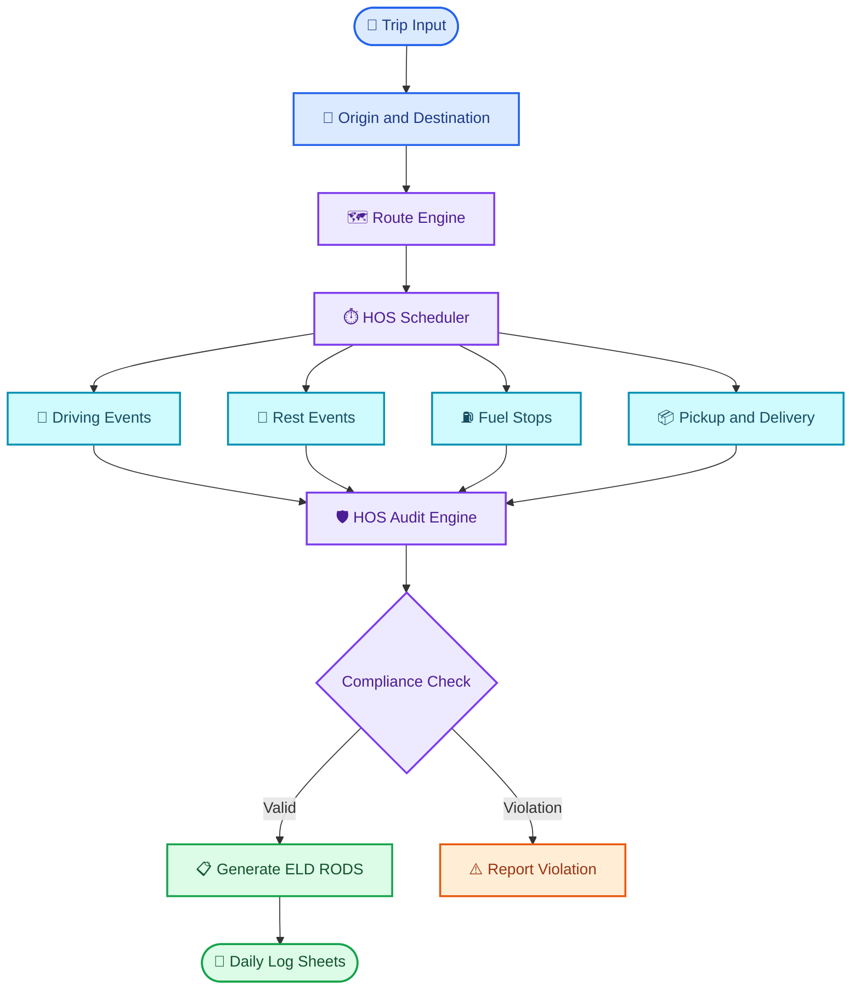
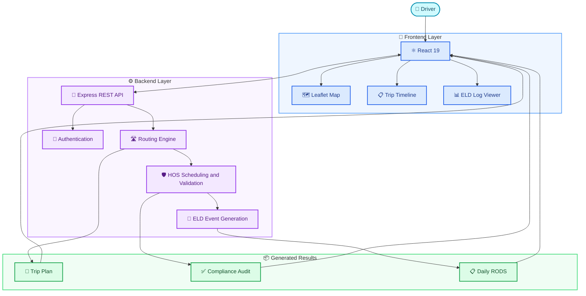
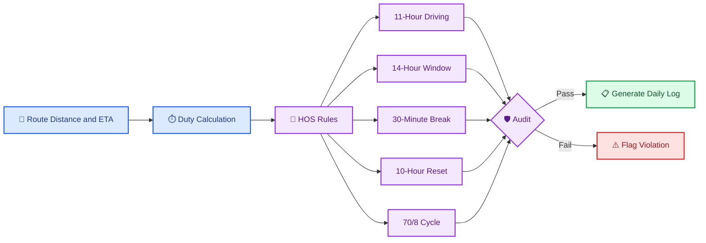

### 🚛 From Route to ELD Log

```mermaid
flowchart TD
    A(["🚛 Trip Input"]) --> B["📍 Origin and Destination"]
    B --> C["🗺️ Route Engine"]
    C --> D["⏱️ HOS Scheduler"]

    D --> E["🚛 Driving Events"]
    D --> F["🛌 Rest Events"]
    D --> G["⛽ Fuel Stops"]
    D --> H["📦 Pickup and Delivery"]

    E --> I["🛡️ HOS Audit Engine"]
    F --> I
    G --> I
    H --> I

    I --> J{"Compliance Check"}
    J -->|Valid| K["📋 Generate ELD RODS"]
    J -->|Violation| L["⚠️ Report Violation"]

    K --> M(["📄 Daily Log Sheets"])

    classDef input fill:#DBEAFE,stroke:#2563EB,color:#1E3A8A,stroke-width:2px
    classDef engine fill:#EDE9FE,stroke:#7C3AED,color:#4C1D95,stroke-width:2px
    classDef events fill:#CFFAFE,stroke:#0891B2,color:#164E63,stroke-width:2px
    classDef success fill:#DCFCE7,stroke:#16A34A,color:#14532D,stroke-width:2px
    classDef warning fill:#FFEDD5,stroke:#EA580C,color:#9A3412,stroke-width:2px

    class A,B input
    class C,D,I,J engine
    class E,F,G,H events
    class K,M success
    class L warning
```

### 🏗️ Full-Stack System Architecture

```mermaid
flowchart TB
    DRIVER(["👤 Driver"])

    subgraph FRONTEND["🎨 Frontend Layer"]
        UI["⚛️ React 19"]
        MAP["🗺️ Leaflet Map"]
        TIMELINE["📋 Trip Timeline"]
        ELD["📊 ELD Log Viewer"]
    end

    subgraph BACKEND["⚙️ Backend Layer"]
        API["🚂 Express REST API"]
        AUTH["🔐 Authentication"]
        ROUTE["🛣️ Routing Engine"]
        HOS["🛡️ HOS Scheduling and Validation"]
        LOGS["📄 ELD Event Generation"]
    end

    subgraph OUTPUT["📦 Generated Results"]
        TRIP["🚛 Trip Plan"]
        AUDIT["✅ Compliance Audit"]
        DAILY["📋 Daily RODS"]
    end

    DRIVER --> UI
    UI --> MAP
    UI --> TIMELINE
    UI --> ELD

    UI <--> API
    API --> AUTH
    API --> ROUTE
    ROUTE --> HOS
    HOS --> LOGS

    ROUTE --> TRIP
    HOS --> AUDIT
    LOGS --> DAILY

    TRIP --> UI
    AUDIT --> UI
    DAILY --> UI

    classDef frontend fill:#DBEAFE,stroke:#2563EB,color:#1E3A8A,stroke-width:2px
    classDef backend fill:#F3E8FF,stroke:#9333EA,color:#581C87,stroke-width:2px
    classDef output fill:#DCFCE7,stroke:#16A34A,color:#14532D,stroke-width:2px
    classDef actor fill:#CFFAFE,stroke:#0891B2,color:#164E63,stroke-width:2px

    class UI,MAP,TIMELINE,ELD frontend
    class API,AUTH,ROUTE,HOS,LOGS backend
    class TRIP,AUDIT,DAILY output
    class DRIVER actor

    style FRONTEND fill:#EFF6FF,stroke:#60A5FA,stroke-width:2px
    style BACKEND fill:#FAF5FF,stroke:#C084FC,stroke-width:2px
    style OUTPUT fill:#F0FDF4,stroke:#4ADE80,stroke-width:2px
```

### 🛡️ HOS Compliance Pipeline

```mermaid
flowchart LR
    A["📏 Route Distance and ETA"] --> B["⏱️ Duty Calculation"]
    B --> C["🧠 HOS Rules"]

    C --> D["11-Hour Driving"]
    C --> E["14-Hour Window"]
    C --> F["30-Minute Break"]
    C --> G["10-Hour Reset"]
    C --> H["70/8 Cycle"]

    D --> I{"🛡️ Audit"}
    E --> I
    F --> I
    G --> I
    H --> I

    I -->|Pass| J["📋 Generate Daily Log"]
    I -->|Fail| K["⚠️ Flag Violation"]

    classDef start fill:#DBEAFE,stroke:#2563EB,color:#1E3A8A,stroke-width:2px
    classDef rules fill:#F3E8FF,stroke:#9333EA,color:#581C87,stroke-width:2px
    classDef pass fill:#DCFCE7,stroke:#16A34A,color:#14532D,stroke-width:2px
    classDef fail fill:#FEE2E2,stroke:#DC2626,color:#991B1B,stroke-width:2px

    class A,B start
    class C,D,E,F,G,H,I rules
    class J pass
    class K fail
```
